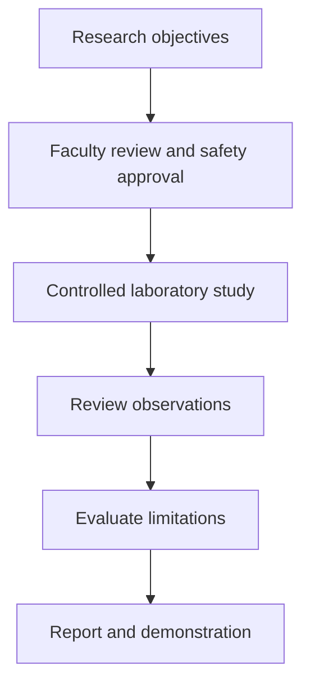

# Conceptual project workflow

```mermaid
flowchart TD
 A[Research objectives] --> B[Faculty review and safety approval]
 B --> C[Controlled laboratory study]
 C --> D[Review observations]
 D --> E[Evaluate limitations]
 E --> F[Report and demonstration]
```

This is a proposal-level project workflow, not an implementation schematic.
